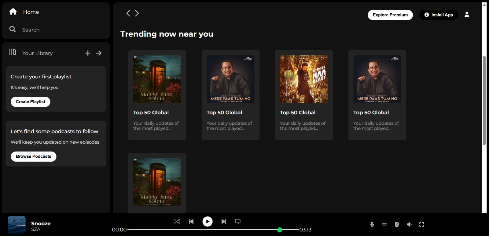

#  Spotify Frontend Clone

A static frontend clone of the Spotify Web Player built using **HTML** and **CSS**. This project was created to practice modern layout techniques, including Flexbox, reusable components, and UI structuring.

---

##  Project Overview

This clone replicates the UI of the official Spotify Web Player, including:
- Sidebar with navigation
- Music library cards (Recently Played, Trending, Charts)
- Sticky top bar with profile and install buttons
- Bottom music player layout
- Responsive structure using Flexbox

---

##  Features

- Static and responsive layout
- Custom styling with external fonts and icons
- Mimics Spotify's clean and modern interface
- Organized into reusable card and layout components

---

##  Tech Stack

- HTML5  
- CSS3  
- Font Awesome (for icons)  
- Google Fonts (Montserrat, Roboto)

---

##  What I Learned

- Building real-world UI layouts  
- Flexbox for responsive design  
- Sidebar and navbar structuring  
- Designing consistent UI sections with CSS

---  

##  Screenshots

---

##  Future Improvements

- Add audio functionality with JavaScript  
- Make the player bar interactive  
- Add user playlists or integrate Spotify API (advanced)  
- Make fully mobile responsive

---

##  Acknowledgements

This is a learning project inspired by [Spotify](https://spotify.com/).  
Built for educational and personal portfolio purposes only — no copyright infringement intended.

---

